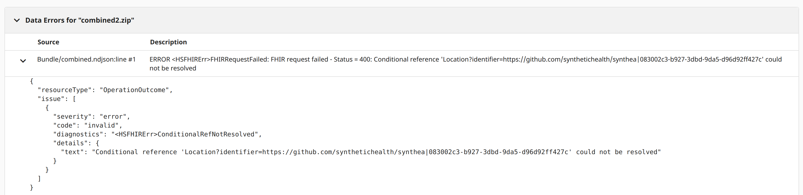
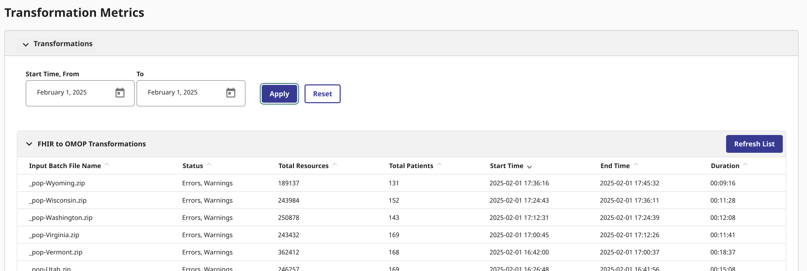
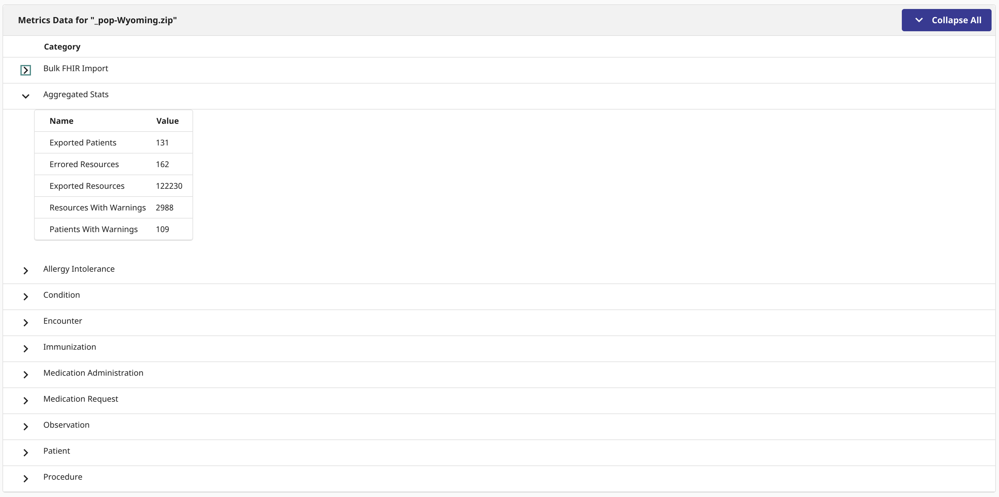

# Yet Another Synthea Fork
Holds a snapshot fork and helper scripts to generate synthetic data using the great Synthea<sup>TM</sup> resource.  Particularly handling notes and take aways from generating for different products and use cases in my ventures.

## Generate Bundles for InterSystems OMOP Server
This generates FHIR Resources, that we _convert_ into FHIR Bulk Export format (.zip) in a process.  It will generate about a 100-150 for all states, and also generate a .zip for the organizations, practitioners, and the population.

We construct Bulk FHIR Export as there seems to be this issue every time I try to post bundles, bulk fhir imports with InterSystems FHIR Related products.  This way, as seen in the script below, we can grep out problematic references so they post wihtout issue... a simple pre loading data quality step before loading to Bronze.

Fixing reference format...

```
  find . -type f -exec sed -i s#"?identifier=https:\/\/github.com\/synthetichealth\/synthea|"#/\#g {} +
  find . -type f -exec sed -i s#"?identifier=http:\/\/hl7.org\/fhir\/sid\/us-npi|"#/\#g {} +
```



## Load Order

Load the org-State.zip First.
Load the prac-$State.zip Second.
Then load the pop-$state Last.

## Attestation
When loading the InterSystems OMOP Server (with FHIR Conversion capabilities), the entire generated data set loaded each state at about 10 minutes a shot...



Each state had very good coverage with varying resource counts using the default modules included in this repo.



## Samples
Included in the `upload` folder is example output for the state of Michigan.


Here is the script below to get an idea on how I use it to iterate and generate fhir for testing.

`intersystems_omop_data.sh`

```bash
rm -rf output
rm -rf upload
mkdir upload

declare -a states=("Alabama" "Alaska" "Arizona" "Arkansas" "California" "Colorado" "Connecticut" "Delaware" "Florida" "Georgia" "Hawaii" "Idaho" "Illinois" "Indiana" "Iowa" "Kansas" "Kentucky" "Louisiana" "Maine" "Maryland" "Massachusetts" "Michigan" "Minnesota" "Mississippi" "Missouri" "Montana" "Nebraska" "Nevada" "Ohio" "Oklahoma" "Oregon" "Pennsylvania" "Tennessee" "Texas" "Utah" "Vermont" "Virginia" "Washington" "Wisconsin" "Wyoming")


for state in ${!states[@]}; do
  echo ${states[$state]}
  count=`shuf -i 100-150 -n 1`
  ./run_synthea -s 234 -p $count ${states[$state]} --exporter.baseDirectory="./output/output_${states[$state]}/"
  cd output/output_${states[$state]}/fhir
  find . -type f -exec sed -i s#"?identifier=https:\/\/github.com\/synthetichealth\/synthea|"#/\#g {} +
  find . -type f -exec sed -i s#"?identifier=http:\/\/hl7.org\/fhir\/sid\/us-npi|"#/\#g {} +
  jq -c . hospital*.json > hospital.ndjson
  zip -r hosp-${states[$state]}.zip hospital.ndjson
  jq -c . practitioner*.json > practitioner.ndjson
  zip -r prac-${states[$state]}.zip practitioner.ndjson
  jq -c . *.json > pop-${states[$state]}.ndjson
  zip -r pop-${states[$state]}.zip pop-${states[$state]}.ndjson
  cp *.zip ../../../upload
  cd ../../../
  pwd
done
```


# Synthea<sup>TM</sup> Patient Generator  [](https://codecov.io/gh/synthetichealth/synthea)

Synthea<sup>TM</sup> is a Synthetic Patient Population Simulator. The goal is to output synthetic, realistic (but not real), patient data and associated health records in a variety of formats.

Read our [wiki](https://github.com/synthetichealth/synthea/wiki) and [Frequently Asked Questions](https://github.com/synthetichealth/synthea/wiki/Frequently-Asked-Questions) for more information.

Currently, Synthea<sup>TM</sup> features include:
- Birth to Death Lifecycle
- Configuration-based statistics and demographics (defaults with Massachusetts Census data)
- Modular Rule System
  - Drop in [Generic Modules](https://github.com/synthetichealth/synthea/wiki/Generic-Module-Framework)
  - Custom Java rules modules for additional capabilities
- Primary Care Encounters, Emergency Room Encounters, and Symptom-Driven Encounters
- Conditions, Allergies, Medications, Vaccinations, Observations/Vitals, Labs, Procedures, CarePlans
- Formats
  - HL7 FHIR (R4, STU3 v3.0.1, and DSTU2 v1.0.2)
  - Bulk FHIR in ndjson format (set `exporter.fhir.bulk_data = true` to activate)
  - C-CDA (set `exporter.ccda.export = true` to activate)
  - CSV (set `exporter.csv.export = true` to activate)
  - CPCDS (set `exporter.cpcds.export = true` to activate)
- Rendering Rules and Disease Modules with Graphviz

## Developer Quick Start

These instructions are intended for those wishing to examine the Synthea source code, extend it or build the code locally. Those just wishing to run Synthea should follow the [Basic Setup and Running](https://github.com/synthetichealth/synthea/wiki/Basic-Setup-and-Running) instructions instead.

### Installation

**System Requirements:**
Synthea<sup>TM</sup> requires Java JDK 11 or newer. We strongly recommend using a Long-Term Support (LTS) release of Java, 11 or 17, as issues may occur with more recent non-LTS versions.

To clone the Synthea<sup>TM</sup> repo, then build and run the test suite:
```
git clone https://github.com/synthetichealth/synthea.git
cd synthea
./gradlew build check test
```

### Changing the default properties


The default properties file values can be found at `src/main/resources/synthea.properties`.
By default, synthea does not generate CCDA, CPCDA, CSV, or Bulk FHIR (ndjson). You'll need to
adjust this file to activate these features.  See the [wiki](https://github.com/synthetichealth/synthea/wiki)
for more details, or use our [guided customizer tool](https://synthetichealth.github.io/spt/#/customizer).


### Generate Synthetic Patients
Generating the population one at a time...
```
./run_synthea
```

Command-line arguments may be provided to specify a state, city, population size, or seed for randomization.
```
run_synthea [-s seed] [-p populationSize] [state [city]]
```

Full usage info can be printed by passing the `-h` option.
```
$ ./run_synthea -h     

> Task :run
Usage: run_synthea [options] [state [city]]
Options: [-s seed]
         [-cs clinicianSeed]
         [-p populationSize]
         [-r referenceDate as YYYYMMDD]
         [-g gender]
         [-a minAge-maxAge]
         [-o overflowPopulation]
         [-c localConfigFilePath]
         [-d localModulesDirPath]
         [-i initialPopulationSnapshotPath]
         [-u updatedPopulationSnapshotPath]
         [-t updateTimePeriodInDays]
         [-f fixedRecordPath]
         [-k keepMatchingPatientsPath]
         [--config*=value]
          * any setting from src/main/resources/synthea.properties

Examples:
run_synthea Massachusetts
run_synthea Alaska Juneau
run_synthea -s 12345
run_synthea -p 1000
run_synthea -s 987 Washington Seattle
run_synthea -s 21 -p 100 Utah "Salt Lake City"
run_synthea -g M -a 60-65
run_synthea -p 10 --exporter.fhir.export=true
run_synthea --exporter.baseDirectory="./output_tx/" Texas
```

Some settings can be changed in `./src/main/resources/synthea.properties`.

Synthea<sup>TM</sup> will output patient records in C-CDA and FHIR formats in `./output`.

### Synthea<sup>TM</sup> GraphViz
Generate graphical visualizations of Synthea<sup>TM</sup> rules and modules.
```
./gradlew graphviz
```

### Concepts and Attributes
Generate a list of concepts (used in the records) or attributes (variables on each patient).
```
./gradlew concepts
./gradlew attributes
```

# License

Copyright 2017-2023 The MITRE Corporation

Licensed under the Apache License, Version 2.0 (the "License");
you may not use this file except in compliance with the License.
You may obtain a copy of the License at

    http://www.apache.org/licenses/LICENSE-2.0

Unless required by applicable law or agreed to in writing, software
distributed under the License is distributed on an "AS IS" BASIS,
WITHOUT WARRANTIES OR CONDITIONS OF ANY KIND, either express or implied.
See the License for the specific language governing permissions and
limitations under the License.
