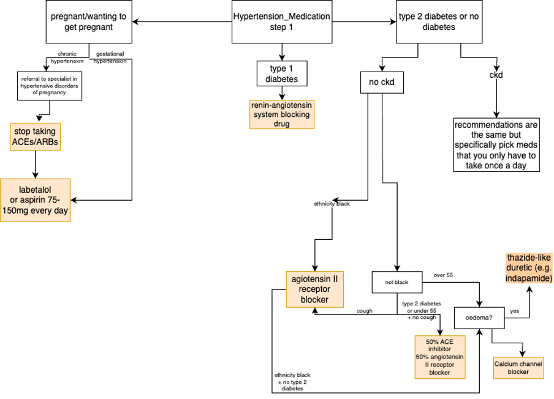
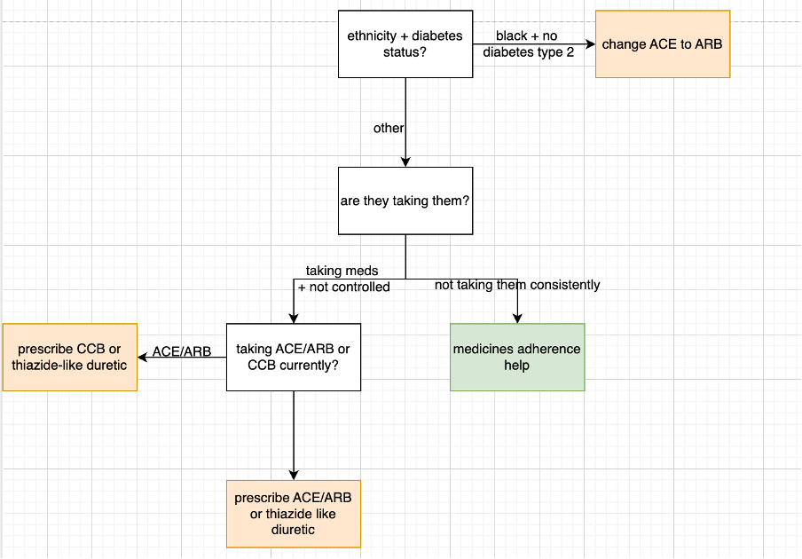
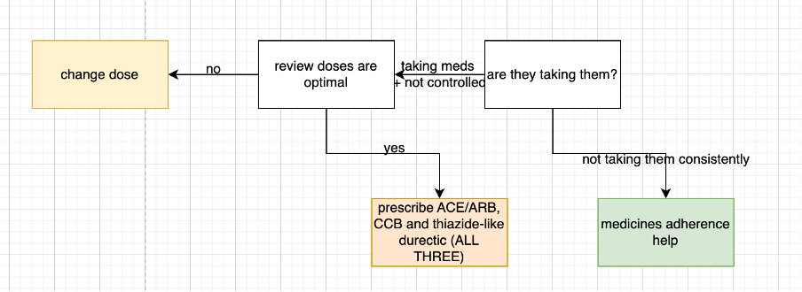
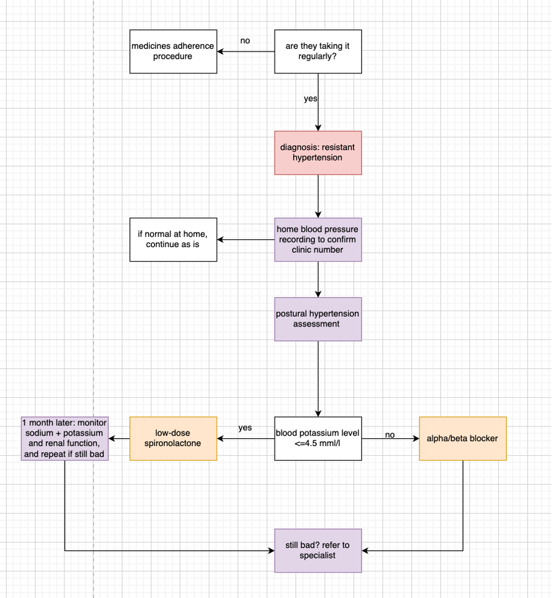

# Creating a New Disease Module in Synthea

## Introduction
This guide will walk you through the steps to create a new disease module in the Synthea synthetic data generator.

## Prerequisites
- Basic knowledge of JSON
- Familiarity with Synthea's module framework
- [NICE guidelines](https://www.nice.org.uk/guidance) for the pathway you want a module for 

## Pre-work 
We would recommend creating a flow diagram of the NICE pathway, thinking about every condition that would send you down different routes, every situation where you'd interact with the health system (e.g. get a measurement, test, appointment, diagnosis etc.), to base yourself off when it comes to making the module. You can see some example flow charts [here](#example-flowchart).

## Steps

### 1. Define the Module
Create a new JSON file in the `src/main/resources/modules` directory. Name it appropriately, e.g., `my_new_disease.json`.

### 2. Structure the Module
A Synthea module consists of states and transitions. Here is a basic structure:

```json
{
    "name": "My New Disease",
    "states": {
        "Initial": {
            "type": "Initial",
            "direct_transition": "DiseaseOnset"
        },
        "DiseaseOnset": {
            "type": "ConditionOnset",
            "target_encounter": "encounter",
            "codes": [
                {
                    "system": "SNOMED-CT",
                    "code": "123456",
                    "display": "My New Disease"
                }
            ],
            "direct_transition": "Terminal"
        },
        "Terminal": {
            "type": "Terminal"
        }
    }
}
```

### 3. Add States and Transitions
Define the states and transitions that represent the progression of the disease. Common states include `ConditionOnset`, `Symptom`, `Encounter`, and `MedicationOrder`. If wanting to define these in a more visual way without needing to write out all the json, try using the Synthea [Module Builder](https://synthetichealth.github.io/module-builder/) and exporting out the json when you're done. 

### 4. Validate the Module
Use the Synthea module validation and testing tool to ensure your module is correctly formatted:
```sh
./run_synthea -m my_new_disease
```

### 6. Iterate and Improve
Review the generated data and refine your module as needed.

For more detailed information, refer to the [Synthea Module Builder documentation](https://github.com/synthetichealth/synthea/wiki/Adding-a-Module) and the [Generic Module Framework](https://github.com/synthetichealth/synthea/wiki/Generic-Module-Framework).

## Tips & Tricks
- Try your module with made up diagnoses that are easy to spot in your data for ease of testing
- Test as you go! Don't build the whole module & only then test.

## Example Flowchart
These are some example flow charts for the hypertension diagnosis & management NICE guidelines:







