# Diabetic Retinopathy

# Synthea™ Module Companion Guide

# 

# Introduction

Synthea™ is an open-source synthetic patient generator that models the
life and medical history of synthetic patients to produce realistic but
not real synthetic health records. The core of Synthea is its disease
modules which represent the progression and treatment of various
diseases. This document describes the scope and intent of the Diabetic
Retinopathy Progression and Treatment modules.

# Synthea Basics

Synthea’s Generic Module Framework (GMF) enables the modeling of various
diseases and conditions that contribute to the medical history of
synthetic patients. Each patient is simulated independently from birth
to present day. Their diseases, conditions and medical care are defined
by one or more generic modules.

Each module models events that could occur in a real patient’s life,
describing a progression of states and the transitions between them.
These modules are informed by clinicians and real-world statistics
collected by the CDC, NIH, and other research sources. Synthea started
with modules for the top ten reasons patients visit their primary care
physician and the top ten conditions that result in years of life lost.
Check out our [<u>full gallery of
modules</u>](https://github.com/synthetichealth/synthea/tree/gh-pages/graphviz)
to see what we've added since.

# High-Level Description

Diabetic retinopathy is modeled in Synthea as two separate but
interrelated processes: disease progression and treatment.

The **Diabetic Retinopathy Progression** submodule is called from the
Metabolic Syndrome Disease Progression module every month if the patient
has diabetes, and represents the chance that an individual will progress
to the next state of retinopathy that month. See \[Module Parameters\]
for details on the sequence and progression %’s. This submodule also
includes a possible onset of macular edema or blindness, in line with
the disease progression of diabetic retinopathy.

The **Diabetic Retinopathy Treatment** top-level module represents the
ophthalmic treatment cycle a patient with diabetes will go through. This
module starts with a Guard state that allows only patients with an
active diagnosis diabetes, then two possible paths prior to their first
encounter: some patients follow recommended practices and will seek an
ophthalmologist for screening right away after the diabetes diagnosis,
some patients will wait until there are significant symptoms. Once a
patient is in the treatment cycle, they will continue to have encounters
based on the recommended follow-up schedule for their disease status.

At the start of each encounter, the **OphthalmicProgression** submodule
is called to align various attributes with the patient’s current disease
status, so that those attributes can be read at the subsequent
examination states. Then the patient will have basic exams performed:

- visual acuity (via the **Visual Acuity** submodule),

- intraocular pressure (via the **Intraocular Pressure** submodule),

- slit-lamp,

- dilation,

- gonioscopy, and

- fundoscopy.

If the patient has previously been diagnosed with diabetic retinopathy,
an OCT will be performed (via the **Ophthalmic Tomography** submodule).
Further diagnoses will be made in the **Diabetic Retinopathy Diagnoses**
submodule. Treatments will be considered based on the AAO PPP:
panretinal laser, grid laser, and anti-VEGF injections. Finally, the
**OphthalmicNote** submodule is called to create an unstructured note
based on the observations and procedures from this encounter.

These modules and submodules are intended to reflect the most common
diagnoses and treatment options associated with diabetic retinopathy,
not necessarily every possible complication and comorbidity. Treatment
plans represented in the module are primarily based on the American
Academy of Ophthalmology® (AAO) Diabetic Retinopathy Preferred Practice
Pattern® (PPP), 2019 edition\[1\].

# Module Diagrams

TODO: figure out the best way to represent these.
Module builder screenshots are easy but tough to read for large
modules

## Diabetic Retinopathy Treatment

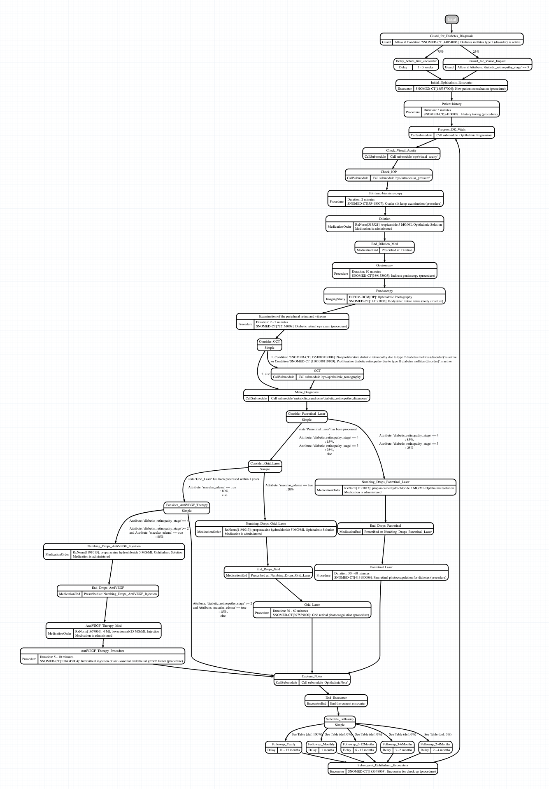

## Submodules

Note: the OphthalmicProgression and OphthalmicNote submodules are
Java-based, not written in the generic module framework, and so the
representations below are conceptual. These two submodules are
considered “experimental” and so are not included in the \`master\`
branch of Synthea.

### Intraocular Pressure

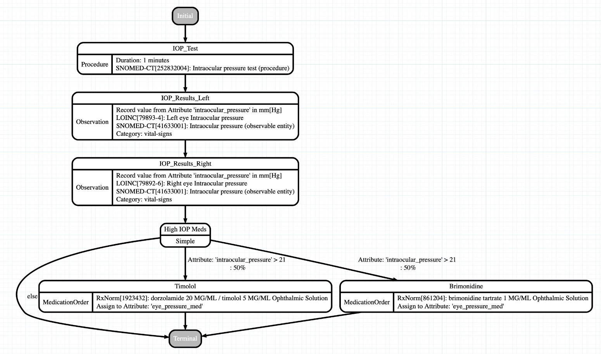

### Ophthalmic Tomography

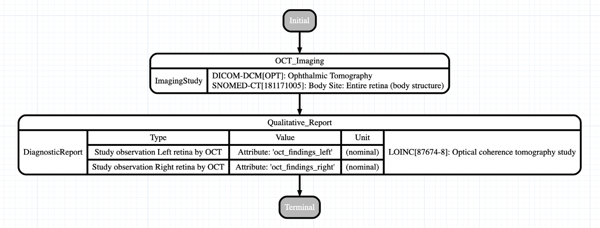

### Visual Acuity

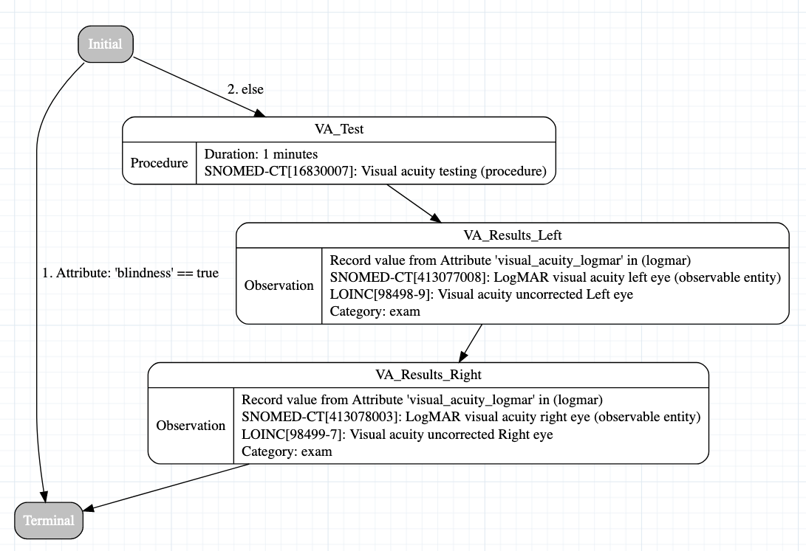

### Diabetic Retinopathy Diagnoses

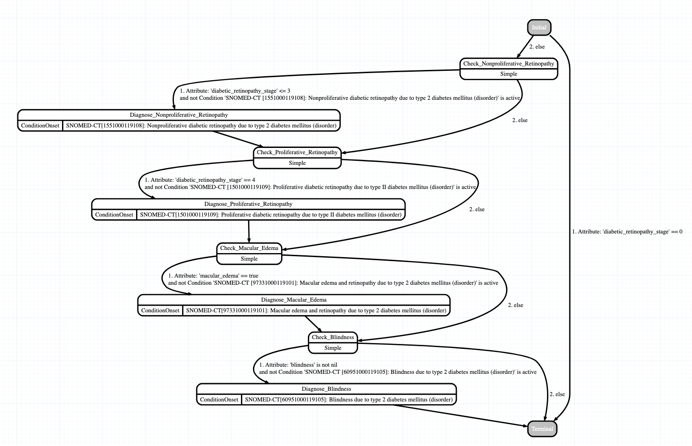

### Diabetic Retinopathy Progression

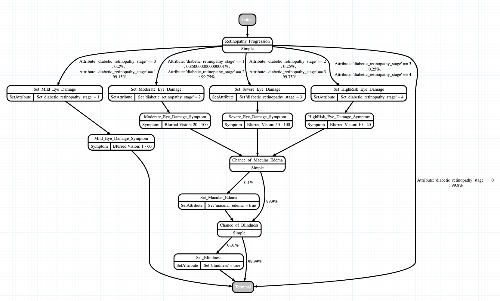

### OphthalmicProgression

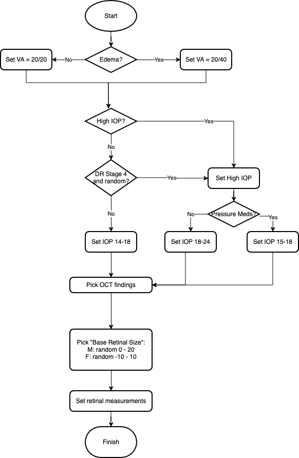

### OphthalmicNote

A note per encounter is structured as follows:

- Report the dates each stage of retinopathy was first observed

- Report the history of grid laser & panretinal laser procedures
  performed

- Visual Acuity in 20/x format

- IOP

- Static text for Pupils, Extraocular Movements, Confrontation Visual
  Fields, Anterior Segment, Optic Disc, Periphery

- Edema, present or not based on diagnosis

- Vessels, text depends on DR stage

- Optional “discussed \_ with patient” lines based on hba1c and whether
  this is the first encounter

# Module Concepts

Table 1 lists the clinical concepts used in the Diabetic Retinopathy
module. For brevity, this table does not include concepts used in the
Metabolic Syndrome/Diabetes modules other than those specifically
relevant to Diabetic Retinopathy.

| System | Code | Display | Module |
|----|----|----|----|
| LOINC | 57108-3 | Macular grid.center point thickness by OCT | ophthalmic_tomography |
| LOINC | 57109-1 | Macular grid.center subfield thickness by OCT | ophthalmic_tomography |
| LOINC | 57110-9 | Macular grid.inner superior subfield thickness by OCT | ophthalmic_tomography |
| LOINC | 57111-7 | Macular grid.inner nasal subfield thickness by OCT | ophthalmic_tomography |
| LOINC | 57112-5 | Macular grid.inner inferior subfield thickness by OCT | ophthalmic_tomography |
| LOINC | 57113-3 | Macular grid.inner temporal subfield thickness by OCT | ophthalmic_tomography |
| LOINC | 57114-1 | Macular grid.outer superior subfield thickness by OCT | ophthalmic_tomography |
| LOINC | 57115-8 | Macular grid.outer nasal subfield thickness by OCT | ophthalmic_tomography |
| LOINC | 57116-6 | Macular grid.outer inferior subfield thickness by OCT | ophthalmic_tomography |
| LOINC | 57117-4 | Macular grid.outer temporal subfield thickness by OCT | ophthalmic_tomography |
| LOINC | 57118-2 | Macular grid.total volume by OCT | ophthalmic_tomography |
| LOINC | 57119-0 | Optical coherence tomography panel | ophthalmic_tomography |
| LOINC | 79818-1 | Study observation Right retina by OCT | ophthalmic_tomography |
| LOINC | 79819-9 | Study observation Left retina by OCT | ophthalmic_tomography |
| LOINC | 79892-6 | Right eye Intraocular pressure | Intraocular Pressure |
| LOINC | 79893-4 | Left eye Intraocular pressure | Intraocular Pressure |
| LOINC | 87674-8 | Optical coherence tomography study | ophthalmic_tomography |
| LOINC | 98498-9 | Visual acuity uncorrected Left eye | Visual Acuity |
| LOINC | 98499-7 | Visual acuity uncorrected Right eye | Visual Acuity |
|  |  |  |  |
| RxNorm | 1657066 | 4 ML bevacizumab 25 MG/ML Injection | Diabetic Retinopathy Treatment |
| RxNorm | 1923432 | dorzolamide 20 MG/ML / timolol 5 MG/ML Ophthalmic Solution | Intraocular Pressure |
| RxNorm | 861204 | brimonidine tartrate 1 MG/ML Ophthalmic Solution | Intraocular Pressure |
|  |  |  |  |
| SNOMED-CT | 1004045004 | Intravitreal injection of anti-vascular endothelial growth factor (procedure) | Diabetic Retinopathy Treatment |
| SNOMED-CT | 1501000119109 | Proliferative diabetic retinopathy due to type II diabetes mellitus (disorder) | diabetic retinopathy diagnoses |
| SNOMED-CT | 1551000119108 | Nonproliferative diabetic retinopathy due to type 2 diabetes mellitus (disorder) | diabetic retinopathy diagnoses |
| SNOMED-CT | 16830007 | Visual acuity testing (procedure) | Visual Acuity |
| SNOMED-CT | 185387006 | New patient consultation (procedure) | Diabetic Retinopathy Treatment |
| SNOMED-CT | 252832004 | Intraocular pressure test (procedure) | Intraocular Pressure |
| SNOMED-CT | 389153003 | Indirect gonioscopy (procedure) | Diabetic Retinopathy Treatment |
| SNOMED-CT | 397539000 | Grid retinal photocoagulation (procedure) | Diabetic Retinopathy Treatment |
| SNOMED-CT | 413077008 | LogMAR visual acuity left eye (observable entity) | Visual Acuity |
| SNOMED-CT | 413078003 | LogMAR visual acuity right eye (observable entity) | Visual Acuity |
| SNOMED-CT | 413180006 | Pan retinal photocoagulation for diabetes (procedure) | Diabetic Retinopathy Treatment |
| SNOMED-CT | 41633001 | Intraocular pressure (observable entity) | Intraocular Pressure |
| SNOMED-CT | 55468007 | Ocular slit lamp examination (procedure) | Diabetic Retinopathy Treatment |
| SNOMED-CT | 60951000119105 | Blindness due to type 2 diabetes mellitus (disorder) | diabetic retinopathy diagnoses |
| SNOMED-CT | 722161008 | Diabetic retinal eye exam (procedure) | Diabetic Retinopathy Treatment |
| SNOMED-CT | 84100007 | History taking (procedure) | Diabetic Retinopathy Treatment |
| SNOMED-CT | 97331000119101 | Macular edema and retinopathy due to type 2 diabetes mellitus (disorder) | diabetic retinopathy diagnoses |

Table 1. List of Concepts used in the Modules

# Module Transition Weights

| Parameter | Value | Notes |
|----|----|----|
| % of patients that enter the ophthalmic care cycle immediately following a Diabetes diagnosis | 0.75 | Estimate to model difference in care-seeking behavior; some patients do not until symptoms present |
| % of patients that have a panretinal laser procedure performed at stage 4, per encounter | 0.85 | Based on AAO PPP description “Recommended” \[1\] |
| % of patients that have a panretinal laser procedure performed at stage 3, per encounter | 0.25 | Based on AAO PPP description “Sometimes” \[1\] |
| % of patients with macular edema that have a grid laser procedure performed, per encounter | 0.2 | Based on AAO PPP description “Sometimes” \[1\] |
| % of patients that have an anti-VEGF injection performed at stage 2 or 3, per encounter | 0.85 | Based on AAO PPP description “Usually” \[1\] |
| % chance of progressing from stage 0 to 1, per month | 0.002 | Estimates based on experimentation; goal is to match prevalence estimates: 28.5–40.3 % of patients with type 2 diabetes had DR, and 4.4–8.2 % of them had vision-threatening DR \[2\], \[3\] |
| % chance of progressing from stage 1 to 2, per month | 0.0085 |  |
| % chance of progressing from stage 2 to 3, per month | 0.0025 |  |
| % chance of progressing from stage 3 to 4, per month | 0.0025 |  |

Table 2. List of Weights used in the Modules

# Eyes on FHIR Implementation Guide

With the goal of promoting interoperability, the Synthea data is
intended to conform to the Ophthalmology Retinal Implementation Guide
(IG) at <https://build.fhir.org/ig/HL7/fhir-eyecare-ig/index.html> .
While this IG has not been formally published, based on an environmental
scan it is the most robust IG relevant to ophthalmic imaging. Where
possible, resources align to relevant profiles and use appropriate
terminology. Because some of the fields and resources used by this IG
are not used by the Synthea engine, certain aspects of the data are
created using a Synthea Flexporter Mapping. If this mapping is specified
in the run command, these changes are applied to the output records:

- Apply the following profiles based on the relevant code:

  - <http://hl7.org/fhir/uv/eyecare/StructureDefinition/observation-iop>

  - <http://hl7.org/fhir/uv/eyecare/StructureDefinition/observation-visual-acuity>

  - <http://hl7.org/fhir/uv/eyecare/StructureDefinition/diagnostic-report-oct-macula>

- Delete MedicationRequests for numbing and dilation drops as these are
  not “prescribed” and in practice would not be present on a record.

  - Note: Synthea has no way to represent administration of a medication
    without a MedicationRequest first. This change deletes the
    MedicationRequest but leaves the MedicationAdministration

- Adds missing values per the requirements on the profiles:

  - Adds SNOMED 400914004 "Early Treatment of Diabetic Retinopathy Study
    visual acuity chart (physical object)" to Visual Acuity
    Observation.method

  - Adds SNOMED 394594003 "Ophthalmology (qualifier value)" to OCT
    DiagnosticReport.category

# Running the Module

To generate the most robust set of data, it is necessary to use the
diabetic_retinopathy branch of Synthea – this branch includes additional
experimental features which are not implemented on the main branch.
Refer to the Developer Setup and Running guide on the Synthea wiki
(<https://github.com/synthetichealth/synthea/wiki/Developer-Setup-and-Running>
) for instructions on how to setup Synthea, then run git checkout
diabetic_retinopathy to switch to the relevant branch.

Note 1: to reduce the size of the final dataset, you may wish to remove
modules for conditions that are not of interest. Relationships between
modules can make this tricky, so for instance make sure not to remove
conditions associated with diabetes, but for the most part it is safe to
remove top-level modules from the src/main/resources/modules folder, not
subfolders.

Note 2: Synthea by default will generate a nonspecific population,
meaning diseases should occur at realistic prevalence rates. For a
condition like diabetic retinopathy that occurs at a low rate among the
overall population, you likely will want to filter the results so that
only patients with the condition are exported. Synthea uses a “Keep
Module” for this, and includes keep modules for Diabetes, NPDR, and PDR.
The example below uses the diabetes keep module, to ensure that all
exported patients have an active diagnosis of diabetes.

Note 3: Synthea by default will try to generate a population that
matches the demographics of the target location (if not specified, the
default location is Massachusetts). In Synthea, it is impossible for
anyone under age 18 to have diabetes or diabetic retinopathy, and the
chances increase with age, so to prevent wasting time trying to generate
impossible records, it is recommended to specify a target age range for
generating a dataset. In the example below we use age 55-70.

The command to run to generate 1,000 patients, age 55-70, with diabetes,
and FHIR data conformant to the Eyes on FHIR IG is:

./run_synthea -p 1000 -a 55-70 -k keep_diabetes.json -fm
src/test/resources/flexporter/eyes_on_fhir.yaml

Additional flags as listed on the Developer Setup and Running guide on
the Synthea wiki may be appended as well.

# Associating Images

The coherent-data/associate_images.py script is used to associate images
generated in a separate process with the ImagingStudy resources on
patient records.

The script uses the following logic to associate ImagingStudy resources
to images for a given patient:

1.  First iterate through all resources in the Bundle:

    1.  Store ImagingStudy resources with the relevant Fundus imaging or
        OCT code.

    2.  Store DiagnosticReport resources with the relevant OCT code.

    3.  Store Conditions with the relevant NPDR, PDR, or DME code.

2.  Then iterate through the stored ImagingStudy resources:

    1.  Find the context at the time of the ImagingStudy: the associated
        Encounter, which Conditions were active at that time, etc.

    2.  Select an image from the appropriate index based on the context:

        1.  If the patient’s disease state matches the previous disease
            state, re-use the previous image

        2.  For Fundus images:

            1.  If the patient has NPDR, select an image with DR == 1

            2.  Otherwise, select an image with DR == 0

        3.  For OCT:

            1.  If the patient has DME, select an image with Class ==
                DME.

            2.  Otherwise, select an image with Class == Normal.

    3.  Mark the image as “selected” in the index, so it is not re-used
        for other patients.

    4.  Create and save a DICOM for the selected image.

    5.  Create a FHIR Media resource for the image and add it to the
        Bundle.

3.  Save the updated Bundle.

The script runs as follows:

python associate_images.py fundusindex.csv octindex.csv ../input_fhir
--clean

where the parameters are:

- fundusindex.csv: the path to the index of Fundus images

- octindex.csv: the path to the index of OCT images

- ../input_fhir: the path to the folder containing FHIR bundles

- --clean: (optional) delete the output directory before running

This script produces output in the ./output folder, with subfolders for
modified FHIR bundles (with Media resoures included), plain images, and
DICOM images.

# Sample Results

The following results have been selected from the larger cohort, and
loaded into the Synthea Toolkit at
<https://synthetichealth.github.io/spt/#/record_viewer> to provide a
quick overview of the patient record. For brevity, only relevant
snippets of the record are shown.

## Sample Patient 1 – Diabetic, No Diabetic Retinopathy

(from Eddie505_Fahey393_aaaacea1-7d11-0312-a70f-3a51cf6b1043.json)

Diabetes diagnosed in 2016:

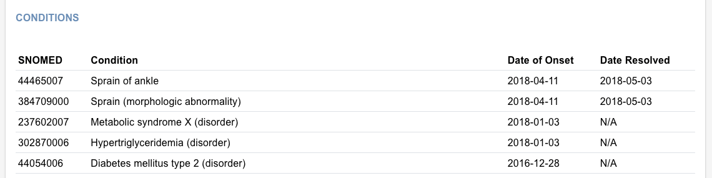

First encounter in 2017:

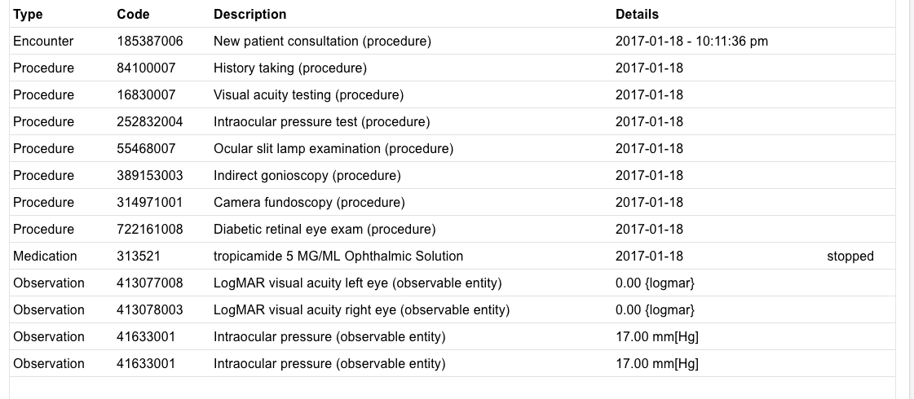

Corresponding note:

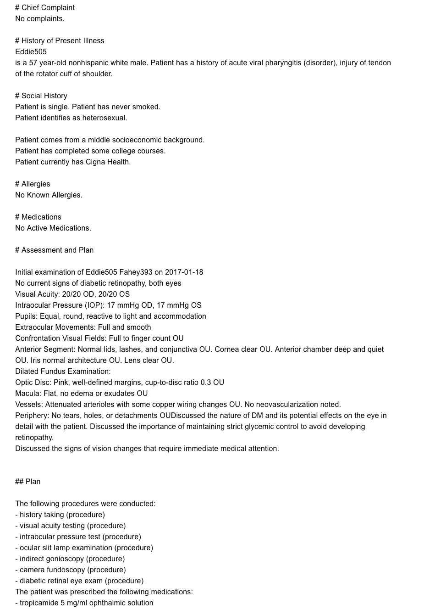

## Sample Patient 2 – Nonproliferative Diabetic Retinopathy

(from Rashida558_Robel940_a5212d81-6f77-2f4d-0a75-e2726b0e5386.json)

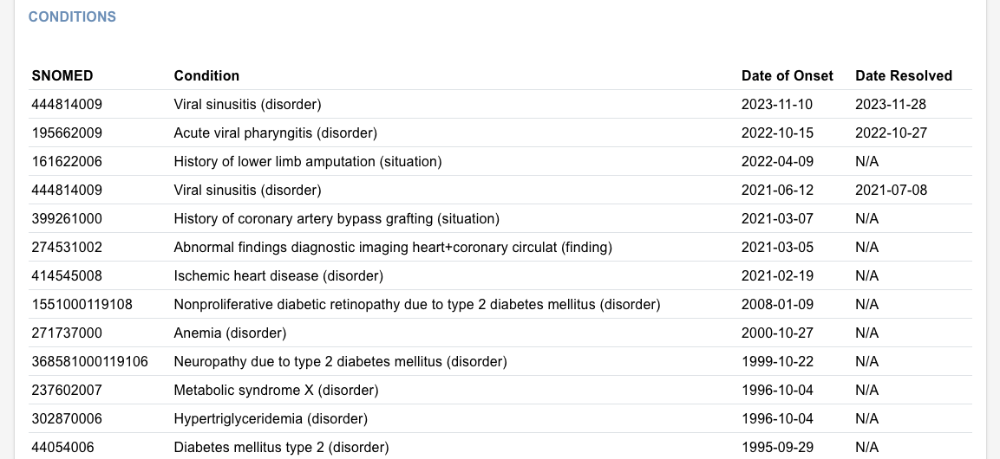

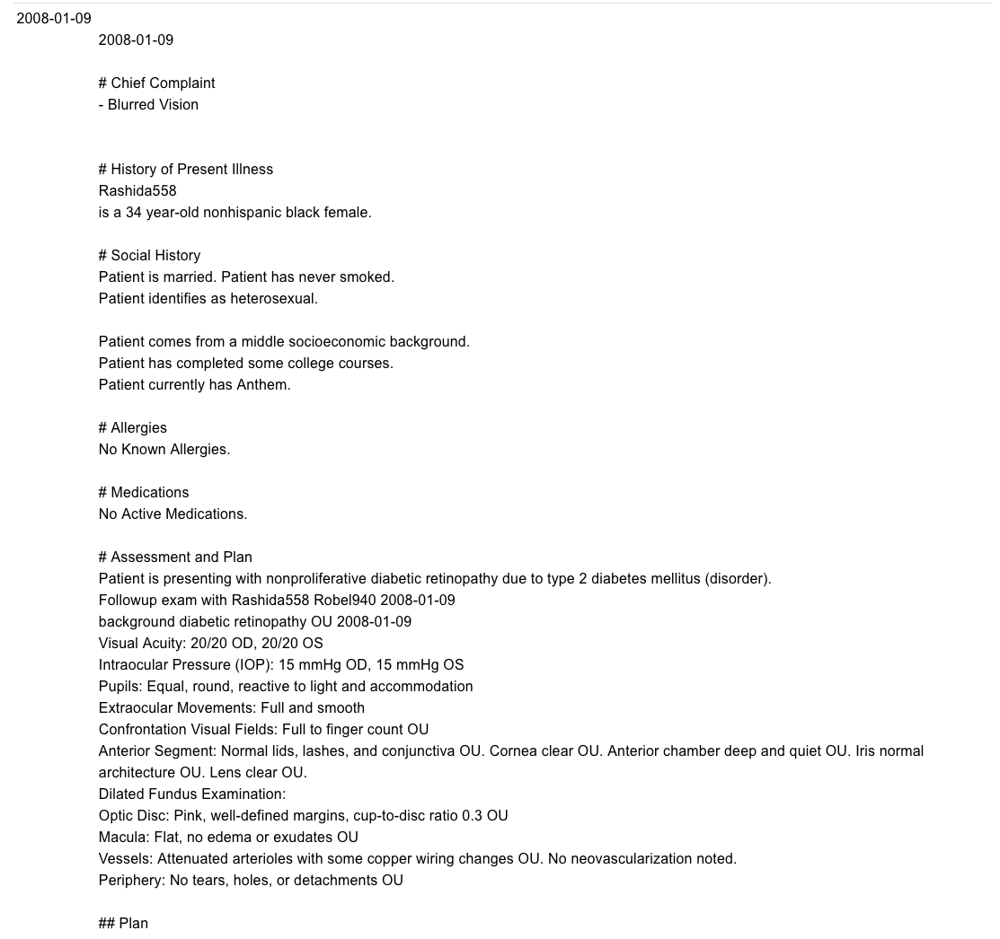

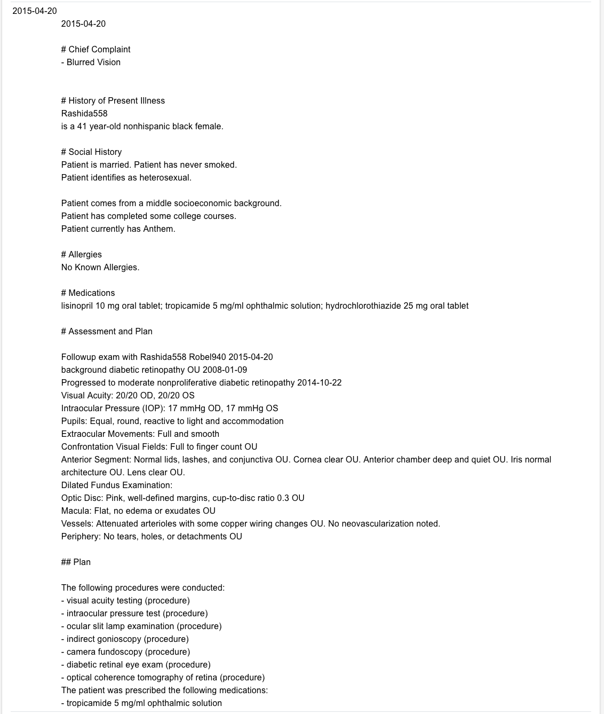

## Sample Patient 3 – Proliferative Diabetic Retinopathy

(from
Isa815_Alysa236_Wilkinson796_2e8cd653-606c-497c-eafd-32e44992d437.json)

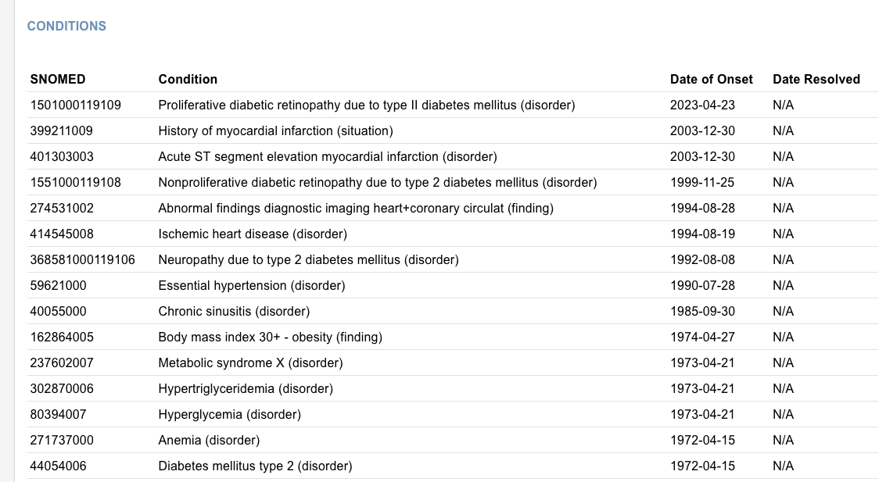

# References

1.  C. J. Flaxel *et al.*, “Diabetic retinopathy preferred practice
    pattern®,” *Ophthalmology*, vol. 127, no. 1, Sep. 2019.
    doi:10.1016/j.ophtha.2019.09.025

2.  The Eye Diseases Prevalence Research Group, “The prevalence of
    diabetic retinopathy among adults in the United States,” *Archives
    of Ophthalmology*, vol. 122, no. 4, p. 552, Apr. 2004.
    doi:10.1001/archopht.122.4.552

3.  R. Lee, T. Y. Wong, and C. Sabanayagam, “Epidemiology of diabetic
    retinopathy, diabetic macular edema and related vision loss,” *Eye
    and Vision*, vol. 2, no. 1, Sep. 2015. doi:10.1186/s40662-015-0026-2

4.  

5.  

###### 

###### Abbreviations and Acronyms

A list of abbreviations/acronyms should be included for documents that
contain 10 or more abbreviations/acronyms. The list of
abbreviations/acronyms includes all abbreviations, initialisms, and
acronyms listed in the document. The list must be sorted alphabetically.
(Select the entire table and then select 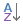 to sort the list.) Sample
abbreviations/acronyms are listed in the following table.

| **Term** | **Definition**                        |
|----------|---------------------------------------|
| **AAO**  | American Academy of Ophthalmology®    |
| **DME**  | Diabetic Macular Edema                |
| **DR**   | Diabetic Retinopathy                  |
| **NPDR** | Nonproliferative Diabetic Retinopathy |
| **OCT**  | Optical Coherence Tomography          |
| **PDR**  | Proliferative Diabetic Retinopathy    |
| **PPP**  | Preferred Practice Pattern® (by AAO)  |
|          |                                       |

Abbreviations and AcronymsThe first column lists the abbreviatons and
acronyms. The second column spells out what the abbreviation or acronym
stands for.

**To convert to Markdown when ready:**

brew install pandoc

pandoc -f docx -t gfm diabetic_retinopathy_module_guide.docx -o
output.md --extract-media=./
